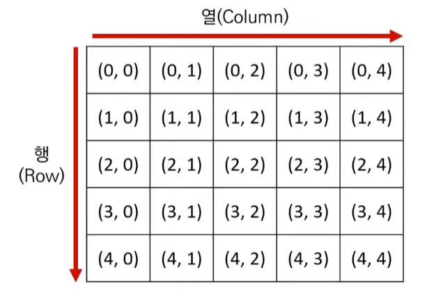
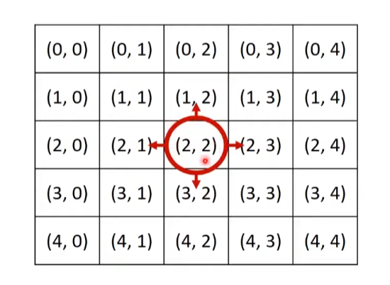
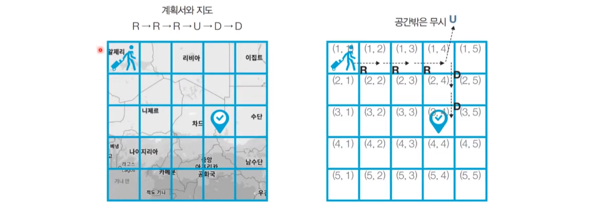

# 4_구현(Implementation) [↩](../this_is_codingtest)

## contents📑<a id="contents"></a>

1. 아이디어를 코드로 바꾸는 구현[✏](#4_1)
2. <문제> 상하좌우[✏](#4_2)

## 4_1 아이디어를 코드로 바꾸는 구현[📑](#contents)<a id="4_1"></a>

* 구현 : 시뮬레이션과 완전 탐색

### 구현

* 구현이란, **머릿속에 있는 알고리즘을 소스코드로 바꾸는 과정** 입니다.

  

* 흔히 알고리즘 대외에서 구현 유형의 문제란 무엇을 의미할까요?

  * **풀이를 떠올리는 것은 쉽지만 소스코드로 옮기기 어려운 문제** 를 지칭함.

* 구현 유형의 예시는 다음과 같음.

  * 알고리즘은 간단한데 코드가 지나칠 만큼 길어지는 문제

    > 프로그래밍 언어에 따라 문제가 어려워질수도 쉬워질 수도 있음.

  * 실수 연산을 다루고 특정 소수점 자리까지 출력해야하는 문제

  * 문자열을 특정한 기준에 따라서 끊어 처리해야 하는 문제

    > 낮은 난이도...파이썬으로 풀기 쉬운 경우가 있음.

  * 적절한 라이브러리를 찾아서 사용해야 하는 문제

    > 라이브러리를 찾아야 함.  - 모든 순열 모든 조합을 찾는 것: `itertools`

* 일반적으로 알고리즘 문제에서의 2차원 공간은 **행렬(Matrix)** 의 의미로 사용됨.

  

  ```python
  for i in range(5):
      for j in range(5):
          print('(',i,',',j.')', end=' ')
      print()
  ```

* 시뮬레이션 및 완전 탐색 문제에서는 2차원 공간에서의 **방향 벡터** 가 자주 활용됩니다.

  

  ```python
  # 동, 북, 서, 남
  dx = [0, -1, 0, 1]
  dy = [1, 0, -1, 0]
  
  # 현재 위치
  x, y = 2, 2
  
  for i in range(4):
      # 다음 위치
      nx = x + dx[i]
      ny = y + dy[i]
      print(nx, ny)
  ```

## 4_2 <문제> 상하좌우[📑](#contents)<a id="4_2"></a>

### <문제> 상하좌우 : 문제 설명

* 여행가 A는 N*N크기의 정사각형 공간 위에 서 있습니다. 이 공간은 1 * 1 크기의 정사각형으로 나누어져 있습니다. 가장 왼쪽 위 좌표는 (1, 1)이며, 가장 오른쪽 아래 좌표는 (N, N)에 해당합니다. 여행가 A는 **상, 하, 좌, 우 방향으로 이동** 할 수 있으며, 시작 좌표는 항상 **(1, 1)** 입니다. 우리 앞에는 여행가 A가 이동할 계획이 적힌 계획서가 놓여 있습니다. 
* 계획서에는 하나의 줄에 띄어쓰기를 기준으로 하여 L, R, U, D 중 하나의 문자가 반복적으로 적혀 있습니다. 각 문자의 의미는 다음과 같습니다. 
  * L : 왼쪽으로 한 칸 이동
  * R : 오른쪽으로 한 칸 이동
  * U : 위로 한 칸 이동
  * D : 아래로 한 칸 이동

* 이때 여행가 A가 N * N 크기의 정사각형 공간을 벗어나는 움직임은 무시됩니다. 예를 들어 (1, 1)의 위치에서 L 혹은 U를 만나면 무시됩니다. 다음은 N = 5인 지도와 계획서입니다. 

  

  | 난이도 | 풀이 시간 | 시간제한 | 메모리 제한 |
  | ------ | --------- | -------- | ----------- |
  | ●○○    | 15분      | 2초      | 128MB       |

  

#### 입력 조건

* 첫째 줄에 공간의 크기를 나타내는 N이 주어집니다. (1 ≤ N ≤ 100)
* 둘째 줄에 여행가 A가 이동할 계획서 내용이 주어집니다.(1 ≤ 이동 횟수 ≤ 100)

#### 출력 조건

* 첫째 줄에 여행가 A가 최종적으로 도착할 지점의 좌표(X, Y)를 공백을 기준으로 구분하여 출력합니다.

#### 입력예시

```python
in[0]
5
R R R U D D

out[0]
3 4
```

### <문제> 상하좌우 : 문제 해결 아이디어

* 이 문제는 요구사항대로 충실히 구현하면 되는 문제임.
* 일련의 명령에 따라서 개체를 차례대로 이동시킨다는 점에서 시뮬레이션(Simulation) 유형으로도 분류되며 구현이 중요한 대표적인 문제 유형임.
  * 다만, 알고리즘 교재나 문제 풀이 사이트에 따라서 다르게 일컬을 수 있으므로, 코딩 테스트에서의 시뮬레이션 유형, 구현 유형, 완전 탐색 유형은 서로 유사한 점이 많다는 정도로만 기억하면 좋음.

```python
# N 입력 받기
n = int(input())
x, y = 1, 1
plans = input().split()

# L, R, U, D에 따른 이동 방향
dx = [0, 0, -1, 1]
dy = [-1, 1, 0, 0]
move_types = ['L', 'R', 'U', 'D']

# 이동 계획을 하나씩 확인하기
for plan in plans:
    # 이동 후 좌표 구하기
    for i in range(len(move_types)):
        if plan == move_types[i]:
            nx = x+dx[i]
            ny = y+dy[i]
    # 공간을 벗어나는 경우 무시
    if nx < 1 or ny < 1 or nx > n or ny > n:
        continue
    # 이동 수행
    x, y = nx, ny
print(x, y)
```

