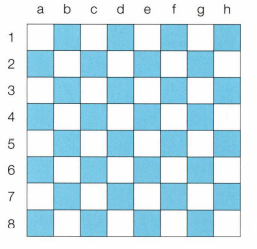

# Q2. 왕실의 나이트[↩](../this_is_codingtest)

| 난이도 | 풀이 시간 | 시간 제한 | 메모리 제한 |
| ------ | --------- | --------- | ----------- |
| ●○○    | 20분      | 1초       | 128MB       |

## 🖋️문제

행복 왕국의 왕실 정원은 체스판과 같은 8 X 8 좌표 평면이다. 왕실 정원의 특정한 한 칸에 나이트 가 서 있다. 나이트는 매우 충성스러운 신하로서 매일 무술을 연마한다. 

나이트는 말을 타고 있기 때문에 이동을 할 때는 L자 형태로만 이동할 수 있으며 정원 밖으로는 나 갈 수 없다. 나이트는 특정한 위치에서 다음과 같은 2가지 경우로 이동할 수 있다. 

1. 수평으로 두 칸 이동한 뒤에 수직으로 한 칸 이동하기 
2. 수직으로 두 칸 이동한 뒤에 수평으로 한 칸 이동하기



이처럼 8 X 8 좌표 평면상에서 나이트의 위치가 주어졌을 때 나이트가 이동할 수 있는 경우의 수를 출력하는 프로그램을 작성하시오. 이때 왕실의 정원에서 행 위치를 표현할 때는 1부터 8로 표현하 며, 열 위치를 표현할 때는 a부터 h로 표현한다. 

예를 들어 만약 나이트가 a1에 있을 때 이동할 수 있는 경우의 수는 다음 2가지이다. a1의 위치는 좌표 평면에서 구석의 위치에 해당하며 나이트는 정원의 밖으로는 나갈 수 없기 때문이다. 

1. 오른쪽으로 두 칸 이동 후 아래로 한 칸 이동하기 (c2) 
2. 아래로 두 칸 이동 후 오른쪽으로 한 칸 이동하기 (b3)

또 다른 예로 나이트가 c2에 위치해 있다면 나이트가 이동할 수 있는 경우의 수는 6가지이다. 이건 직접 계산해보시오.

### 입력

* 첫째 줄에 8 x 8 좌표 평면상에서 현재 나이트가 위치한 곳의 좌표를 나타내는 두 문자로 구성된 문자 열이 입력된다. 입력 문자는 a1 처럼 열과 행으로 이뤄진다.

### 출력

* 첫째 줄에 나이트가 이동할 수 있는 경우의 수를 출력하시오.

### 예제 입력 & 출력

```python
in[0]
a1

out[0]
2
```

---

## 💡풀이

```python
import sys

input = sys.stdin.readline

pos = input().rstrip()

x, y = ord(pos[0])- ord('a'), int(pos[1])-1

# 왕실의 나이트가 갈 수 있는 방법
cases = [[2, 1], [2, -1], [1, 2], [1, -2], [-2, 1], [-2, -1], [-1, 2], [-1, -2]]

answer = []
for i in cases:
    print(f'{x} + {i[0]}: {x + i[0]}, {y} + {i[1]} : {y + i[1]}')
    if 7 >= x + i[0] >= 0 and 7 >= y + i[1] >= 0:
        answer.append([x + i[0], y + i[1]])
print(len(answer))
```

* 왕실의 나이트가 갈 수 있는 모든 경우의 수를 다음과 같이 구현

  ```python
  cases = [[2, 1], [2, -1], [1, 2], [1, -2], [-2, 1], [-2, -1], [-1, 2], [-1, -2]]
  ```

* 현재 왕실의 나이트의 위치를 0 ~ 7의 범위의 x, y 좌표로 표현한 후 모든 경우의 수로 더해주어 좌표가 8x8의 제한 안에 있는지 확인하고 확인한다면 그 경우를 카운트.

#### 나동빈님 풀이[📌](https://github.com/ndb796/python-for-coding-test/blob/master/5/10.py)

* 
