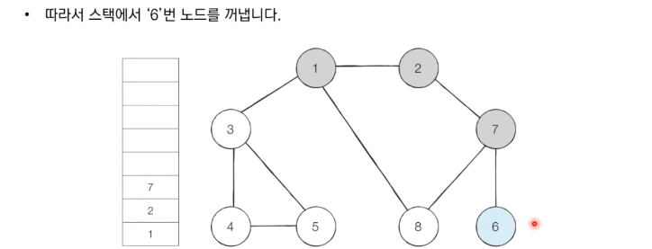

# 4_DFS_BFS [↩](../this_is_codingtest)

## contents📑<a id="contents"></a>

1. 꼭 필요한 자료구조 기초[👉](#4_1)
   * 그래프 탐색 알고리즘:DFS/BFS[✏](#4_1_0)
   * 스택 자료구조[✏](#4_1_1)
   * 큐 자료구조[✏](#4_1_2)
   * 재귀함수[✏](#4_1_3)
2. 탐색 알고리즘:DFS/BFS[👉](#4_2)
   * DFS(Depth-First Search)[✏](#4_2_1)
   * BFS(Breadth-First Search)[✏](#4_2_2)

## 4_1 꼭 필요한 자료구조 기초[📑](#contents)<a id="4_1"></a>

### 그래프 탐색 알고리즘:DFS/BFS[📑](#contents)<a id="4_1_0"></a>

* 탐색(Search)이란 많은 양의 데이터 중에서 **원하는 데이터를 찾는 과정**을 말합니다.
* 대표적인 그래프 탐색 알고리즘으로는 DFS와 BFS가 있습니다.
* **DFS/BFS는 코딩 테스트에서 매우 자주 등장하는 유형**이므로 반드시 숙지해야 합니다.

### 스택 자료구조[📑](#contents)<a id="4_1_1"></a>

* 먼저 들어 온 데이터가 나중에 나가는 형식(선입후출)의 자료구조입니다.
* **입구와 출구가 동일한 형태**로 스택을 시각화할 수 있습니다.


> 박스쌓기 예시로 생각하면 됨.

#### 스택 동작 예시

> 프링글스 과자통과 유사함.


```python
stack = []

# 삽입(5) - 삽입(2) - 삽입(3) - 삽입(7) - 삭제() - 삽입(1) - 삽입(4) - 삭제()
stack.append(5)
stack.append(2)
stack.append(3)
stack.append(7)
stack.pop()
stack.append(1)
stack.append(4)
stack.pop()


print(stack[::-1])	# 최상단 원소부터 출력 -> 뒤집어서 출력
print(stack)		# 최하단 원소부터 출력

# 실행결과
[5, 2, 3, 1]
[1, 3, 2, 5]
```

> 스택 구현 예제(Python)

### 큐 자료구조[📑](#contents)<a id="4_1_2"></a>

* 먼저 들어 온 데이터가 먼저 나가는 형식(선입선출)의 자료구조.
* 큐는 **입구와 출구가 모두 뚫려 있는 터널과 같은 형태**로 시각화 할 수 있습니다.


#### 큐 동작 예시


```python
from collections import deque

# 큐(Queue) 구현을 위해 deque 라이브러리 사용
queue = deque()
# 삽입(5) - 삽입(2) - 삽입(3) - 삽입(7) - 삭제() - 삽입(1) - 삽입(4) - 삭제()
queue.append(5)		# 오른쪽으로 들어와서
queue.append(2)
queue.append(3)
queue.append(7)
queue.popleft()		# 왼쪽으로 나감
queue.append(1)
queue.append(4)
queue.popleft()

print(queue)	# 먼저 들어온 순서대로 출력
queue.reverse()	# 다음 출력을 위해 역순으로 바꾸기
print(queue)	# 나중에 들어온 원소부터 출력

# 실행 결과
deque([3, 7, 1, 4])
deque([4, 1, 7, 3])
```

> 큐 구현 예제(Python)

* `list`를 이용하는 것보다 `deque`을 이용하는 것이 `시간복잡도`면에서 유리함.

### 재귀함수(Recursive Function)[📑](#contents)<a id="4_1_3"></a>

* **재귀 함수(Recursive Function)란 자기 자신을 다시 호출하는 함수**를 의미함.
* 단순한 형채의 재귀 함수 예제
  * '재귀 함수를 호출합니다.'라는 문자열을 무한히 출력합니다.
  * 어느 정도 출력하다가 **최대 재귀 깊이 초과 메시지**가 력됩니다.

```python
def recursive_function():
    print('재귀 함수를 호출합니다.')
    recursive_function()

recursive_function()

재귀 함수를 호출합니다.
...
재귀 함수를 호출합니다.
재귀 함수를 호출합니다.
재귀 함수를 호출합니다.Traceback (most recent call last):
  [Previous line repeated 993 more times]
  File "C:/", line 2, in recursive_function
    print('재귀 함수를 호출합니다.')
RecursionError: maximum recursion depth exceeded while calling a Python object
```

> 재귀함수 예제

#### 재귀 함수의 종료 조건

* 재귀 함수를 문제 풀이에서 사용할 때는 재귀함수의 종료 조건을 반드시 명시해야 합니다.
* 종료 조건을 제대로 명시하지 않으면 함수가 무한히 호출될 수 있습니다.
* 종료조건을 포함한 재귀 함수 예제

```python
def recursive_function(i):
    # 100번째 출력했을 때 종료되도록 종료 조건 명시
    if i == 100:
        return
    print(i, '번째 재귀 함수에서', i + 1, '번째 재귀 함수를 호출합니다.')
    recursive_function(i + 1)
    print(i, '번째 재귀 함수를 종료합니다.')

recursive_function(1)
```

> 재귀 함수 종료 예제

#### 팩토리얼 구현 예제

* n! = 1 x 2 x 3 x … x (n - 1) x n
* 수학적으로 0!과 1!의 값은 1입니다.

```python
# 반복적으로 구현한 n!
def factorial_iterative(n):
    result = 1
    # 1 부터 n까지의 수를 차례대로 곱하기
    for i in range(1, n + 1):
        result *= i
    return result

# 재귀적으로 구현한 n!
def factorial_recursive(n):
    if n <= 1:  # n이 1 이하인 경우 1 을 반환
        return 1
    # n! = n * (n - 1)!를 그대로 코드로 작성하기
    return n * factorial_recursive(n - 1)

# 각각의 방식으로 구현한 n! 출력(n = 5)
print('반복적으로 구현:', factorial_iterative(5))
print('재귀적으로 구현:', factorial_recursive(5))

# 실행 결과
반복적으로 구현: 120
재귀적으로 구현: 120
```

* 재귀함수를 이용하면, 반복문을 사용하지 않아도 됨.

#### 최대공약수 계산(유클리드 호제법)예제

* <u>두 개의 자연수에 대한 최대공약수</u>를 구하는 대표적인 알고리즘으로는 유클리드 호제법이 있습니다.

* **유클리드 호제법**

  * 두 자연수 A, B에 대하여(A > B) A를 B로 나눈 나머지를 R이라고 합시다.
  * 이때 A와 B의 최대공약수는 B와 R의 최대공약수와 같습니다.

* 유클리드 호제법의 아이디어를 그대로 재귀 함수로 작성할 수 있습니다.

  * **예시** : GCD(192, 162) 
  * GCD는 최대공약수를 말함.

  | 단계 |  A   |  B   |
  | :--: | :--: | :--: |
  |  1   | 192  | 162  |
  |  2   | 162  |  30  |
  |  3   |  30  |  12  |
  |  4   |  12  |  6   |

* 코드로 구현

```python
def gcd(a, b):
    if a % b ==0:
        return b
    else:
        return gcd(b, a % b)

print(gcd(192, 162))

# 실행결과
6
```

#### 재귀함수 사용시 유의 사항

* 재귀함수를 잘 활용하면 복잡한 알고리즘을 간결하게 작성할 수 있습니다.
  * 단, 오히려 다른 사람이 이해하기 어려운 형태의 코드가 될 수 있으므로 신중하게 사용해야 합니다.
* 모든 <u>재귀 함수는 반복문을 이용하여 동일한 기능을 구현</u>할 수 있습니다.
* 재귀함수가 반복문보다 유리한 경우도 있고 불리한 경우도 있습니다.
* 컴퓨터가 함수를 연속적으로 호출하면 컴퓨터 메모리 내부의 스택 프레임에 쌓입니다.
  * 그래서 스택을 사용해야 할 때 구현상 **스택 라이브러리 대신에 재귀 함수를 이용**하는 경우가 많습니다.

## 4_2 탐색 알고리즘:DFS/BFS[📑](#contents)<a id="4_2"></a>

### DFS(Depth-First Search)[📑](#contents)<a id="4_2_1"></a>

* DFS는 깊이 우선 탐색이라고도 부르며 그래프에서 깊은 부분을 우선적으로 탐색하는 알고리즘입니다.
* DFS는 스택 자료구조(혹은 재귀함수)를 이용하며, 구체적인 동작 과정은 다음과 같습니다.
  1. 탐색시작 노드를 스택에 삽입하고 방문 처리를 합니다.
  2. 스택의 최상단 노드에 방문하지 않은 인접한 노드가 하나라도 있으면 그 노드를 스택에 넣고 방문처리합니다. 방문하지 않은 인접 노드가 없으면 스택에서 최상단 노드를 꺼냅니다.
  3. 더 이상 2번의 과정을 수행할 수 없을때까지 반복합니다.

#### DFS 동작 예시

* [Step 0] 그래프를 준비합니다.(방문 기준 : 번호가 낮은 인접노드부터)

  

* [Step 1] 시작 노드인 '1'을 스택에 삽입하고 방문처리를 합니다.

  

* [Step 2] 스택의 최상단 노드인'1'에 방문하지 않은 인접 노드'2', '3', '8'이 있습니다.

  

* [Step 3] 스택의 최상단 노드인'2'에 방문하지 않은 인접 노드 '7'이 있습니다.

  

* [Step 4] 스택의 최상단 노드인'7'에 방문하지 않은 인접 노드 '6', '8'이 있습니다.

  

* [Step 5] 스택의 최상단 노드인'6'에 방문하지 않은 인접 노드가 없습니다.

  

* [Step 6] 스택의 최상단 노드인'2'에 방문하지 않은 인접 노드 '7'이 있습니다.

  

* 이러한 과정을 반복했을 때 전체 노드의 탐색 순서(스택에 들어간 순서)는 다음과 같습니다.

  

#### DFS 예제 코드[📌](https://github.com/ndb796/python-for-coding-test/blob/master/5/8.py)

```python
# DFS 메서드 정의
def dfs(graph, v, visited):
    # 현재 노드를 방문 처리
    visited[v] = True
    print(v, end=' ')
    # 현재 노드와 연결된 다른 노드를 재귀적으로 방문
    for i in graph[v]:
        if not visited[i]:
            dfs(graph, i, visited)
# 각 노드가 연결된 정보를 리스트 자료형으로 표현（2차원 리스트）
graph = [
    [],
    [2, 3, 8],
    [1, 7],
    [1, 4, 5],
    [3, 5],
    [3, 4],
    [7],
    [2, 6, 8],
    [1, 7]
]

# 각 노드가 방문된 정보를 리스트 자료형으로 표현 (1차원 리스트）
visited = [False] * 9

# 정의된 DFS 함수 호출
dfs(graph, 1, visited)

# 실행결과
1 2 7 6 8 3 4 5 
```

### BFS(Breadth-First Search)[📑](#contents)<a id="4_2_2"></a>

* BFS는 너비 우선 탐색이라고 부르며, 그래프에서 가까운 노드부터 우선적으로 탐색하는 알고리즘입니다.
* BFS는 큐 자료구조를 이용하며, 구체적인 동작 과정은 다음과 같습니다.
  1. 탐색시작 노드를 큐에 삽입하고 방문처리를 합니다.
  2. 큐에서 노드를 꺼낸 뒤에 해당 노드의 인접 노드 중에서 방문하지 않은 노드를 모두 큐에 삽입하고 방문처리합니다.
  3. 더이상 2번의 과정을 수행할 수 없을때까지 반복합니다.

#### BFS 동작 예시

* [Step 0] 그래프를 준비합니다.(방문 기준 : 번호가 낮은 인접 노드부터)

  

* [Step 1] 시작노드인 '1'을 큐에 삽입하고 방문 처리를 합니다.

  

* [Step 2] 큐에서 노드'1'을 꺼내 방문하지 않은 인접 노드'2', '3', '8'을 큐에 삽입하고 방문 처리합니다.

  

* [Step 3] 큐에서 노드'2'을 꺼내 방문하지 않은 인접 노드'7'을 큐에 삽입하고 방문 처리합니다.

  

* [Step 4] 큐에서 노드'3'을 꺼내 방문하지 않은 인접 노드'4', '5'을 큐에 삽입하고 방문 처리합니다.

  

* [Step 5] 큐에서 노드'8'을 꺼내 방문하지 않은 인접 노드가 없으므로 무시합니다.

  

* 이러한 과정을 반복하여 **전체 노드의 탐색 순서**(큐에 들어간 순서)는 다음과 같습니다.

  

#### BFS 코드 예제 [📌](https://github.com/ndb796/python-for-coding-test/blob/master/5/9.py)

```python
from collections import deque

# BFS 함수 정의
def bfs(graph, start, visited):
    # 큐(Queue) 구현을 위해 deque 라이브러리 사용
    queue = deque([start])
    # 현재 노드를 방문 처리
    visited[start] = True
    # 큐가 빌 때까지 반복
    while queue:
        # 큐에서 하나의 원소를 뽑아 출력
        v = queue.popleft()
        print(v, end=' ')
        # 해당 원소와 연결된, 아직 방문하지 않은 원소들을 큐에 삽입
        for i in graph[v]:
            if not visited[i]:
                queue.append(i)
                visited[i] = True

# 각 노드가 연결된 정보를 리스트 자료형으로 표현(2차원 리스트)
graph = [
  [],
  [2, 3, 8],
  [1, 7],
  [1, 4, 5],
  [3, 5],
  [3, 4],
  [7],
  [2, 6, 8],
  [1, 7]
]

# 각 노드가 방문된 정보를 리스트 자료형으로 표현(1차원 리스트)
visited = [False] * 9

# 정의된 BFS 함수 호출
bfs(graph, 1, visited)

# 실행 결과
1 2 3 8 7 4 5 6
```

