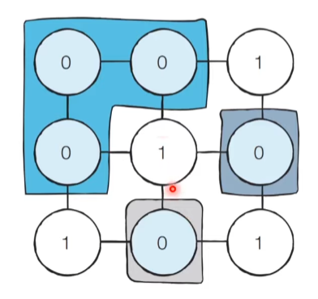

# Q3. 음료수 얼려 먹기[↩](../this_is_codingtest)

| 난이도 | 풀이 시간 | 시간 제한 | 메모리 제한 |
| ------ | --------- | --------- | ----------- |
| ●◐○    | 30분      | 1초       | 12MB        |


## 🖋️문제
N x M 크기의 얼음 틀이 있다. 구멍이 뚫려 있는 부분은 0, 칸막이가 존재하는 부분은 1로 표시된다. 구멍이 뚫려 있는 부분끼리 상, 하, 좌, 우로 붙어 있는 경우 서로 연결되어 있는 것으로 간주한다. 이때 얼음 틀의 모양이 주어졌을 때 생성되는 총 아이스크림의 개수를 구하는 프로그램을 작성 하시오. 다음의 4 x 5 얼음 틀 예시에서는 아이스크림이 총 3개 생성된다.


### 입력
* 첫 번째 줄에 얼음 틀의 세로 길이 N과 가로 길이 M이 주어진다. (1 < N,M < 1,000) 
* 두 번째 줄부터 N + 1 번째 줄까지 얼음 틀의 형태가 주어진다. 
* 이때 구멍이 뚫려있는 부분은 0, 그렇지 않은 부분은 1 이다

### 출력
* 한 번에 만들 수 있는 아이스크림의 개수를 출력한다.

### 예제 입력 & 출력

```python
in[0]
15 14
00000111100000
11111101111110
11011101101110
11011101100000
11011111111111
11011111111100
11000000011111
01111111111111
00000000011111
01111111111000
00011111111000
00000001111000
11111111110011
11100011111111
11100011111111

out[0]
8
```

---

## 💡풀이
```python
import sys

# 행과 열의 개수 입력 받음 
N, M = map(int, sys.stdin.readline().split())

# 구멍이 뚫려 있는 부분과 없는 부분을 입력 받음.
arr = [list(map(str, sys.stdin.readline().rstrip())) for _ in range(N)]

print(arr)
```
* 미완성

#### 나동빈님 풀이[📌](https://github.com/ndb796/python-for-coding-test/blob/master/5/10.py)

* 이 문제는 DFS 혹은 BFS 로 해결할 수 있습니다. 일단 앞에서 배운 대로 얼음을 얼릴 수 있는 공간이 상, 하, 좌, 우 로 연결되어 있다고 표현할 수 있으므로 그래프 형태로 모델링 할 수 있습니다. 다음과 같이 3 * 3크기의 얼음틀이 있다고 가정하고 생각해 봅시다.



> 상하좌우에 따라 인접한 노드 형태로 `그래프`  모델링
>
> 방문처리가 이뤄지는 지점에 대해서만 카운트

* DFS를 활용하는 알고리즘은 다음과 같습니다.
  1. 특정한 지점의 주변 상, 하, 좌, 우를 살펴본 뒤에 주변 지점 중에서 값이 '0'이면서 아직 방문하지 않은 지점이 있다면 해당 지점을 방문합니다.
  2. 방문한 지점에서 다시 상, 하, 좌, 우를 살펴보면서 방문을 진행하는 과정을 반복하면, **연결된 모든 지점을 방문**할 수 있습니다.
  3. 모든 모드에 대하여 1~2번의 과정을 반복하며, 방문하지 않은 지점의 수를 카운트 합니다.

```python
# N, M을 공백을 기준으로 구분하여 입력 받기
n, m = map(int, input().split())

# 2차원 리스트의 맵 정보 입력 받기
graph = []
for i in range(n):
    graph.append(list(map(int, input())))

# DFS로 특정한 노드를 방문한 뒤에 연결된 모든 노드들도 방문
def dfs(x, y):
    # 주어진 범위를 벗어나는 경우에는 즉시 종료
    if x <= -1 or x >= n or y <= -1 or y >= m:
        return False
    # 현재 노드를 아직 방문하지 않았다면
    if graph[x][y] == 0:
        # 해당 노드 방문 처리
        graph[x][y] = 1
        # 상, 하, 좌, 우의 위치들도 모두 재귀적으로 호출
        dfs(x - 1, y)
        dfs(x, y - 1)
        dfs(x + 1, y)
        dfs(x, y + 1)
        return True
    return False

# 모든 노드(위치)에 대하여 음료수 채우기
result = 0
for i in range(n):
    for j in range(m):
        # 현재 위치에서 DFS 수행
        if dfs(i, j) == True:
            result += 1

print(result) # 정답 출력
```

