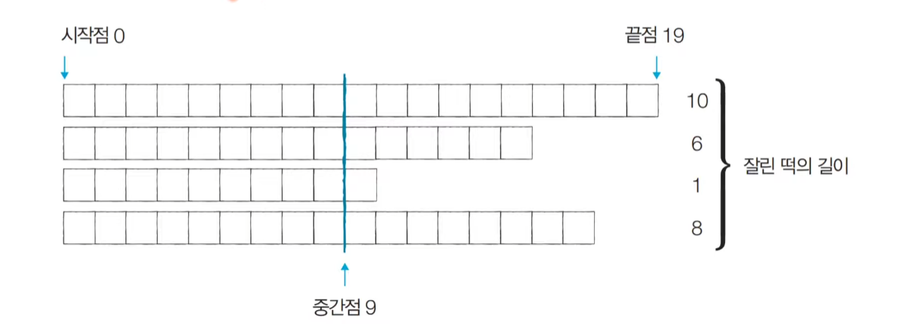
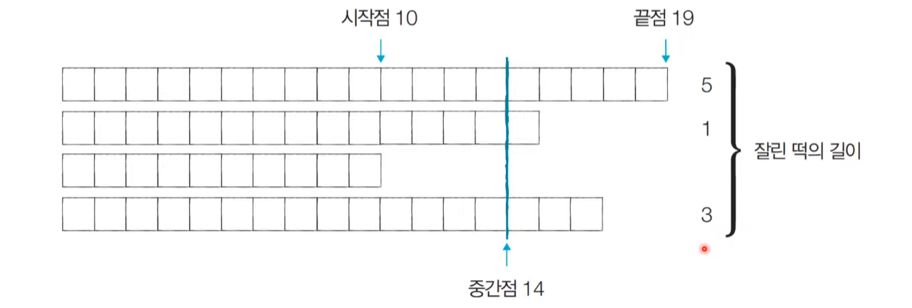
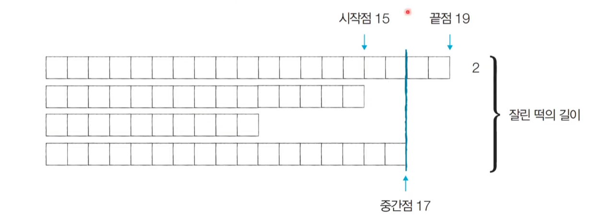
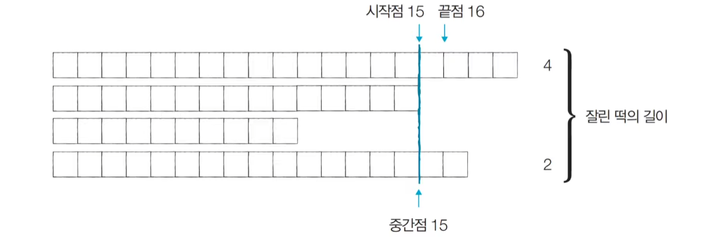

# Q3. 떡볶이 떡 만들기[↩](../this_is_codingtest)

| 난이도 | 풀이 시간 | 시간 제한 | 메모리 제한 |
| ------ | --------- | --------- | ----------- |
| ●●○    | 40분      | 2초       | 128MB       |

## 🖋️문제
오늘 동빈이는 여행 가신 부모님을 대신해서 떡집 일을 하기로 했다. 오늘은 떡볶이 떡을 만드는 날 이다. 동빈이네 떡볶이 떡은 재밌게도 떡볶이 떡의 길이가 일정하지 않다. 대신에 한 봉지 안에 들어 가는 떡의 총 길이는 절단기로 잘라서 맞춰준다. 

절단기에 높이(H)를 지정하면 줄지어진 떡을 한 번에 절단한다. 높이가 H보다 긴 떡은 H 위의 부 분이 잘릴 것이고, 낮은 떡은 잘리지 않는다. 

예를 들어 높이가 19, 14, 10, 17cm인 떡이 나란히 있고 절단기 높이를 15cm로 지정하면 자른 뒤 떡의 높이는 15, 14, 10, 15cm가 될 것이다. 잘린 떡의 길이는 차례대로 4, 0, 0, 2cm이다. 손님은 6cm만큼의 길이를 가져간다. 

손님이 왔을 때 요청한 총 길이가 M일 때 적어도 M만큼의 떡을 얻기 위해 절단기에 설정할 수 있는 높이의 최댓값을 구하는 프로그램을 작성하시오.

### 입력
* 첫째 줄에 떡의 개수 N과 요청한 떡의 길이 M이 주어진다. (1 ≤ N ≤ 1,000,000, 1 ≤ M ≤ 2,000,000,000) 
* 둘째 줄에는 떡의 개별 높이가 주어진다. 떡 높이의 총합은 항상 M 이상이므로, 손님은 필요한 양만큼 떡을 사갈 수 있다. 높이는 10억보다 작거나 같은 양의 정수 또는 0이다.

### 출력
* 적어도 M만큼의 떡을 집에 가져가기 위해 절단기에 설정할 수 있는 높이의 최댓값을 출력한다

### 예제 입력 & 출력

```python
in[0]
4 6
19 15 10 17


out[0]
15
```

---

## 💡풀이
```python

```
* 성공😊
  * 

#### 나동빈님 풀이[📌](https://github.com/ndb796/python-for-coding-test/blob/master/7/8.py)

#### 떡볶이 떡 만들기 : 문제해결 아이디어

* 적절한 높이를 찾을 때까지 이진 탐색을 수행하여 높이 H를 반복해서 조정하면 됩니다.

* '현재 이 높이로 자르면 조건을 만족할 수 있는가?'를 확인한 뒤에 <u>조건의 만족 여부('예' 혹은 '아니오')에 따라서 탐색 범위를 좁혀서 해결</u>할 수 있습니다.

* 절단기의 높이는 0부터 10억까지의 정수 중 하나입니다.

  * 이렇게 큰 탐색 범위를 보면 가장 먼저 **이진탐색**을 떠올려야 합니다.

* 문제에서 제시된 예시를 통해 그림으로 이해해 봅시다.

* [Step 1] 시작점:0, 끝점:19, 중간점:14

  * 이때 필요한 떡의 크기: M = 6이므로, 결과 저장

  

* [Step 2] 시작점:10, 끝점:19, 중간점:14

  * 이때 필요한 떡의 크기: M = 6이므로, 결과 저장
    

* [Step 3] 시작점:15, 끝점:19, 중간점:17

  * 이때 필요한 떡의 크기: M = 6이므로, 결과를 저장하지 않음.

  

* [Step 4] 시작점:15, 끝점:16, 중간점:15

  * 이때 필요한 떡의 크기: M = 6이므로, 결과 저장

  

* 이러한 이진 탐색 과정을 반복하면 답을 도출할 수 있습니다.

* 중간점의 값은 <u>시간이 지날수록 **'최적화된 값'**</u>이 되기 때문에, 과정을 반복하면서 얻을 수 있는 떡의 길이 합이 필요한 떡의 길이보다 크거나 같을 때마다 **중간점의 값을 기록**하면 됩니다. 

#### 떡볶이 떡 만들기 : 답안 예시

``` python
# 떡의 개수(N)와 요청한 떡의 길이(M)을 입력
n, m = list(map(int, input().split(' ')))
# 각 떡의 개별 높이 정보를 입력
array = list(map(int, input().split()))

# 이진 탐색을 위한 시작점과 끝점 설정
start = 0
end = max(array)

# 이진 탐색 수행 (반복적)
result = 0
while(start <= end):
    total = 0
    mid = (start + end) // 2
    for x in array:
        # 잘랐을 때의 떡볶이 양 계산
        if x > mid:
            total += x - mid
    # 떡볶이 양이 부족한 경우 더 많이 자르기 (오른쪽 부분 탐색)
    if total < m:
        end = mid - 1
    # 떡볶이 양이 충분한 경우 덜 자르기 (왼쪽 부분 탐색)
    else:
        result = mid # 최대한 덜 잘랐을 때가 정답이므로, 여기에서 result에 기록
        start = mid + 1

# 정답 출력
print(result)
```


* 
