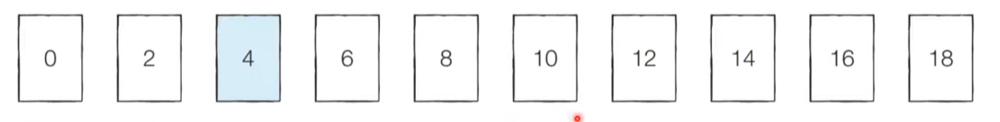
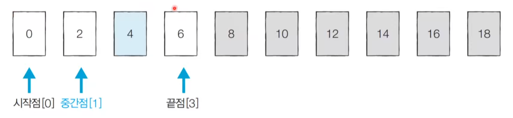

# 7_이진탐색(Binary Search) [↩](../this_is_codingtest)

## contents📑<a id="contents"></a>

1. 범위를 반씩 좁혀가는 탐색[👉](#7_1)
   * 1_1 이진 탐색 알고리즘[✏](#7_1_1)
   * 1_2 이진 탐색 동작 예시[✏](#7_1_2)
   * 1_3 이진 탐색의 시간 복잡도[✏](#7_1_3)
   * 1_4 이진 탐색 소스코드 : 재귀적 구현(python)[✏](#7_1_4)
   * 1_5 이진 탐색 소스코드 : 반복문 구현(python)[✏](#7_1_5)
   * 1_6 파이썬 이진 탐색 라이브러리[✏](#7_1_6)
   * 1_7 값이 특정 범위에 속하는 데이터 개수 구하기[✏](#7_1_7)
   * 1_8 파라메트릭 서치(Parametric Search)[✏](#7_1_8)

## 7_1 범위를 반씩 좁혀가는 탐색[📑](#contents)<a id="7_1"></a>

### 이진 탐색 알고리즘[📑](#contents)<a id="7_1_1"></a>

* 이진 탐색 : 정렬되어 있는 알고리즘에서 특정한 데이터를 빨리 찾게하는 알고리즘.
* 순차 탐색 : 리스트 안에 있는 특정한 **데이터를 찾기 위해 앞에서 부터 데이터를 하나씩 확인** 하는 방법
* 이진 탐색 : 정렬되어 있는 리스트에서 **탐색 범위를 절반씩 좁혀가며 데이터를 탐색** 하는 방법
  * 이진 탐색은 시작점, 끝점, 중간점을 이용하여 탐색 범위를 설정합니다. 

### 이진 탐색 동작 예시[📑](#contents)<a id="7_1_2"></a>

* 이미 정렬된 10개의 데이터 중에서 값이 4인 원소를 찾는 예시를 살펴봅시다.

  

* [Step 1] 시작점 : 0 , 끝점 : 9, 중간점: 4 (소수점 이하 제거)

  

  > 중간점을 기준으로 하여 오른쪽 위치는 더이상 볼 필요가 없음. 끝점을 중간점의 왼쪽으로 옮김.

* [Step 2] 시작점 : 0, 끝점: 3, 중간점: 1 (소수점 이하 제거)

  

  > 우리가 찾고자하는 값은 인덱스 2에 위치함을 알수 있음.

### 이진 탐색의 시간 복잡도[📑](#contents)<a id="7_1_3"></a>

* 단계마다 탐색 범위를 2로 나누는 것과 동일하므로 연산 횟수는 log<sub>2</sub>N에 비례합니다. 
* 예를 들어 초기 데이터 개수가 32개일 때, 이상적으로 1단계를 거치면 16개 가량의 데이터만 남습니다.
  * 2단계를 거치면 8개 가량의 데이터만 남습니다. 
  * 3단계를 거치면 4개 가량의 데이터만 남습니다.
* 다시 말해 이진 탐색은 탐색 범위를 절반씩 줄이며, 시간 복잡도는 `O(logN)`을 보장합니다.  

### 이진 탐색 소스코드 : 재귀적 구현(python)[📑](#contents)<a id="7_1_4"></a>

```python
# 이진 탐색 소스코드 구현 (재귀 함수)
def binary_search(array, target, start, end):
    if start > end:
        return None
    mid = (start + end) // 2
    # 찾은 경우 중간점 인덱스 반환
    if array[mid] == target:
        return mid
    # 중간점의 값보다 찾고자 하는 값이 작은 경우 왼쪽 확인
    elif array[mid] > target:
        return binary_search(array, target, start, mid - 1)
    # 중간점의 값보다 찾고자 하는 값이 큰 경우 오른쪽 확인
    else:
        return binary_search(array, target, mid + 1, end)

# n(원소의 개수)과 target(찾고자 하는 값)을 입력 받기
n, target = list(map(int, input().split()))
# 전체 원소 입력 받기
array = list(map(int, input().split()))

# 이진 탐색 수행 결과 출력
result = binary_search(array, target, 0, n - 1)
if result == None:
    print("원소가 존재하지 않습니다.")
else:
    print(result + 1)
    
# 입력 값   
10 7
1 3 5 7 9 11 13 15 19
# 실행 결과
4

# 입력 값
10 7
1 3 5 6 9 11 13 15 17 19
# 실행 결과
원소가 존재하지 않습니다.
```

### 이진 탐색 소스코드 : 반복문 구현(python)[📑](#contents)<a id="7_1_5"></a>

```python
# 이진 탐색 소스코드 구현 (반복문)
def binary_search(array, target, start, end):
    while start <= end:
        mid = (start + end) // 2
        # 찾은 경우 중간점 인덱스 반환
        if array[mid] == target:
            return mid
        # 중간점의 값보다 찾고자 하는 값이 작은 경우 왼쪽 확인
        elif array[mid] > target:
            end = mid - 1
        # 중간점의 값보다 찾고자 하는 값이 큰 경우 오른쪽 확인
        else:
            start = mid + 1
    return None

# n(원소의 개수)과 target(찾고자 하는 값)을 입력 받기
n, target = list(map(int, input().split()))
# 전체 원소 입력 받기
array = list(map(int, input().split()))

# 이진 탐색 수행 결과 출력
result = binary_search(array, target, 0, n - 1)
if result == None:
    print("원소가 존재하지 않습니다.")
else:
    print(result + 1)
    
# 입력 값   
10 7
1 3 5 7 9 11 13 15 19
# 실행 결과
4

# 입력 값
10 7
1 3 5 6 9 11 13 15 17 19
# 실행 결과
원소가 존재하지 않습니다.
```

### 파이썬 이진 탐색 라이브러리[📑](#contents)<a id="7_1_6"></a>

* `bisect_left(a, x)` : 정렬된 순서를 유지하면서 배열a에 x를 삽입할 가장 왼쪽 인덱스를 반환

* `bisect_right(a, x)`: 정렬된 순서를 유지하면서 배열a에 x를 삽입할 가장 오른쪽 인덱스를 반환

  

  ```python
  from bisect import bisect_left, bisect_right
  
  a = [1,2,4,4,8]
  x = 4
  print(bisect_left(a, x))
  print(bisect_right(a, x))
  
  # 실행 결과
  2
  4
  ```

  

### 값이 특정 범위에 속하는 데이터 개수 구하기[📑](#contents)<a id="7_1_7"></a>

```python
from bisect import bisect_left, bisect_right

# 값이 [left_value, right_value]인 데이터의 개수를 반환하는 함수
def count_by_range(a, left_value, right_value):
    right_index = bisect_right(a, right_value)
    left_index = bisect_left(a, left_value)
    return right_index - left_index
# 배열 선언
a = [1,2,3,3,3,3,4,4,8,9]

# 값이 4인 데이터 개수 출력
print(count_by_range(a, 4, 4))

# 값이 [-1, 3] 범위에 있는 데이터 개수 출력
print(count_by_range(a, -1, 3))

# 실행 결과
2
6
```

### 파라메트릭 서치(Parametric Search)[📑](#contents)<a id="7_1_8"></a>

* **파라메트릭 서치** 란?
  : 최적화 문제를 결정 문제('예' 혹은 '아니오')로 바꾸어 해결하는 기법입니다.
  * 예시 : 특정한 조건을 만족하는 가장 알맞는 값을 빠르게 찾는 최적화 문제
* 일반적으로 코딩테스트에서 파라메트릭 서치 문제는 **이진 탐색을 이용하여 해결** 할 수 있습니다. 
