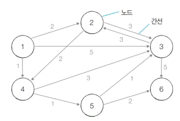
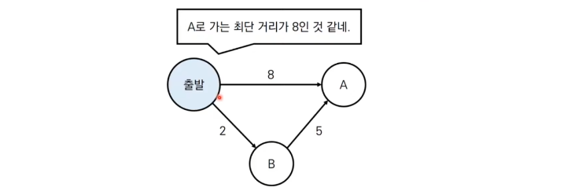
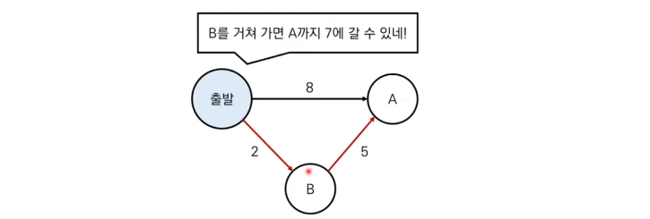
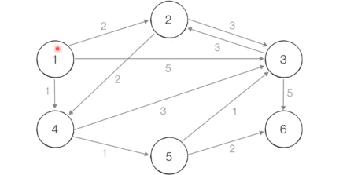
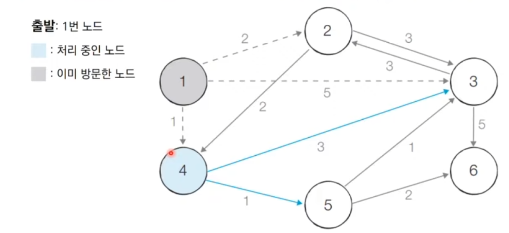
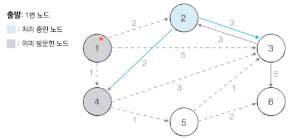
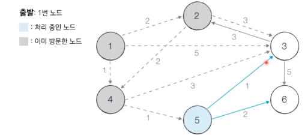
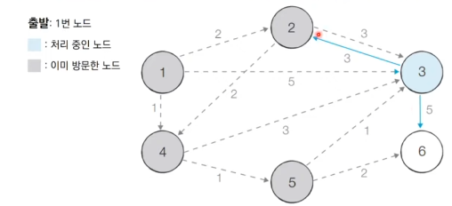
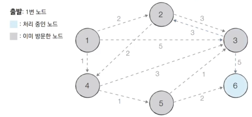

# 9_최단 경로(shortest path) [↩](../this_is_codingtest)

## contents📑<a id="contents"></a>

1. 가장 빠른 길 찾기[👉](#8_1)
   * 최단 경로 문제
   * 다익스트라 최단 경로 알고리즘

## 9_1 가장 빠른 길 찾기[📑](#contents)<a id="9_1"></a>

### 최단 경로 문제



* 최단 경로 알고리즘은 **가장 짧은 경로를 찾는 알고리즘** 을 의미함
* 다양한 문제 상황
  * 한 지점에서 다른 한 지점까지의 최단 경로
  * 한 지점에서 다른 모든 지접까지의 최단 경로
  * 모든 지점에서 다른 모든 지점까지의 최단 경로
* 각 지점은 그래프에서 노드로 표현
* 지점 간 연결된 도로는 그래프에서 간선으로 표현

### 다익스트라 최단 경로 알고리즘 

#### 개요

* **특정한 노드** 에서 출발하여 다른 모든 노드로 가는 최단 경로를 계산함

* 다익스트라 최단 경로 알고리즘은 음의 간섭이 없을 때 정상적으로 동작함

  * 현실세계의 도로(간선)은 음의 간선으로 표현되지 않음

* 다익스트라 최단 경로 알고리즘은 그리디 알고리즘으로 분류됨

  * **매 상황에서 가장 비용이 적은 노드를 선택** 해 임의의 과정을 반복함

* 다익스트라 알고리즘의 **동작 과정**은 다음과 같음.

  1. 출발 노드를 설정함
  2. 최단 거리 테이블을 초기화 함
  3. 방문하지 않은 노드 중에서 최단 거리가 가장 짧은 노드를 선택
  4. 해당 노드를 거쳐 다른 노드로 가는 비용을 계산하여 최단 거리 테이블을 갱신함
  5. 위 과정에서 3번과 4번을 반복

* 알고리즘 종작 과정에서 최단 거리 테이블은 각 노드에 대한 현재까지의 최단 거리 정보를 가지고 있음

* 처리과정에서 더 짧은 경로를 찾으면 '이제부터 이 경로가 제일 짧은 경로야'라고 갱신함

  

  

#### 동작 과정 살펴보기

* [초기 상태] 그래프를 준비하고 출발노드를 설정함

  

  | 노드 번호 | 1    | 2    | 3    | 4    | 5    | 6    |
  | --------- | ---- | ---- | ---- | ---- | ---- | ---- |
  | 거리      | 0    | 무한 | 무한 | 무한 | 무한 | 무한 |

* [Step 1] 방문하지 않은 노드 중에서 최단 거리가 가장 짧은 노드인 1번 노드를 처리함

  

  | 인접 노드 | 현재 값 | 거쳐갈 때 | 갱신 여부 |
  | --------- | ------- | --------- | --------- |
  | 2번       | 무한    | 0+2       | True      |
  | 3번       | 무한    | 0+5       | True      |
  | 4번       | 무한    | 0+1       | True      |

  | 노드 번호 | 1    | 2    | 3    | 4    | 5    | 6    |
  | --------- | ---- | ---- | ---- | ---- | ---- | ---- |
  | 거리      | 0    | 2    | 5    | 1    | 무한 | 무한 |

* [Step 2] 방문하지 않은 노드 중에서 최단 거리가 가장 짧은 노드인 4번 노드를 처리함

  

  | 인접 노드 | 현재 값 | 거쳐갈 때 | 갱신 여부 |
  | --------- | ------- | --------- | --------- |
  | 3번       | 5       | 1+3       | True      |
  | 5번       | 무한    | 1+1       | True      |

  | 노드 번호 | 1    | 2    | 3    | 4    | 5    | 6    |
  | --------- | ---- | ---- | ---- | ---- | ---- | ---- |
  | 거리      | 0    | 2    | 4    | 1    | 2    | 무한 |

* [Step 3] 방문하지 않은 노드 중에서 최단 거리가 가장 짧은 노드인 2번 노드를 처리함

  

    |      | 현재 값 | 거쳐갈 때 | 갱신 여부 |
    | ---- | ------- | --------- | --------- |
    | 3번  | 4       | 2+3       | False     |
    | 5번  | 1       | 2+2       | False     |

    > 현재 값보다 거쳐가는 값이 더 크기 때문에 갱신하지 않음.
    >
    > (현재 값 < 거쳐가는 값)

    | 노드 번호 | 1    | 2    | 3    | 4    | 5    | 6    |
    | --------- | ---- | ---- | ---- | ---- | ---- | ---- |
    | 거리      | 0    | 2    | 4    | 1    | 2    | 무한 |

* [Step 4] 방문하지 않은 노드 중에서 최단 거리가 가장 짧은 노드인 5번 노드를 처리함

  

  |      | 현재 값 | 거쳐갈 때 | 갱신 여부 |
  | ---- | ------- | --------- | --------- |
  | 3번  | 4       | 2+1       | True      |
  | 6번  | 무한    | 2+2       | True      |

  | 노드 번호 | 1    | 2    | 3    | 4    | 5    | 6    |
  | --------- | ---- | ---- | ---- | ---- | ---- | ---- |
  | 거리      | 0    | 2    | 3    | 1    | 2    | 4    |

* [Step 5] 방문하지 않은 노드 중에서 최단 거리가 가장 짧은 노드인 3번 노드를 처리함

  

  |      | 현재 값 | 거쳐갈 때 | 갱신 여부 |
  | ---- | ------- | --------- | --------- |
  | 2번  | 2       | 3+3       | False     |
  | 6번  | 4       | 3+5       | False     |

  | 노드 번호 | 1    | 2    | 3    | 4    | 5    | 6    |
  | --------- | ---- | ---- | ---- | ---- | ---- | ---- |
  | 거리      | 0    | 2    | 3    | 1    | 2    | 4    |

* [Step 6] 방문하지 않은 노드 중에서 최단 거리가 가장 짧은 노드인 6번 노드를 처리함

  * 마지막 노드는 처리하지 않아도 됨
  * 앞서 확인했던 다른 노드까지의 최단거리는 변하지 않음

  

  * 이 예제 에서는 6번 노드에서 출발하는 간선이 존재 하지 않음

  | 노드 번호 | 1    | 2    | 3    | 4    | 5    | 6    |
  | --------- | ---- | ---- | ---- | ---- | ---- | ---- |
  | 거리      | 0    | 2    | 3    | 1    | 2    | 4    |

#### 특징

* 그리디 알고리즘 : **매 상황에서 방문하지 않은 가장 비용이 적은 노드를 선택**해 임의의 과정을 반복함
* 단계를 거치며 **한 번 처리된 노드의 최단 거리는 고정**되어 더 이상 바뀌지 않음
  * **한 단계당 하나의 노드에 대한 최단 거리를 확실히 찾는 것으로 이해**할 수 있음
* 다익스트라 알고리즘을 수행한 뒤에 <u>테이블에서 각 노드까지의 최단 거리 정보</u>가 저장됨
  * 완벽한 형태의 최단 경로를 구하려면 소스코드에 추가적인 기능을 더 넣어야 함

#### 간단한 구현 방법

* 단계마다 방문하지 않은 노드 중에서 최단 거리가 가장 짧은 노드를 선택하기 위해 **매 단계마다 1차원 테이블의 모든 원소를 확인(순차 탐색)**함

  ```python
  import sys
  input = sys.stdin.readline
  INF = int(1e9) # 무한을 의미하는 값으로 10억을 설정
  
  # 노드의 개수, 간선의 개수를 입력받기
  n, m = map(int, input().split())
  # 시작 노드 번호를 입력받기
  start = int(input())
  # 각 노드에 연결되어 있는 노드에 대한 정보를 담는 리스트를 만들기
  graph = [[] for i in range(n + 1)]
  # 방문한 적이 있는지 체크하는 목적의 리스트를 만들기
  visited = [False] * (n + 1)
  # 최단 거리 테이블을 모두 무한으로 초기화
  distance = [INF] * (n + 1)
  
  # 모든 간선 정보를 입력받기
  for _ in range(m):
      a, b, c = map(int, input().split())
      # a번 노드에서 b번 노드로 가는 비용이 c라는 의미
      graph[a].append((b, c))
  
  # 방문하지 않은 노드 중에서, 가장 최단 거리가 짧은 노드의 번호를 반환
  def get_smallest_node():
      min_value = INF
      index = 0 # 가장 최단 거리가 짧은 노드(인덱스)
      for i in range(1, n + 1):
          if distance[i] < min_value and not visited[i]:
              min_value = distance[i]
              index = i
      return index
  
  def dijkstra(start):
      # 시작 노드에 대해서 초기화
      distance[start] = 0
      visited[start] = True
      for j in graph[start]:
          distance[j[0]] = j[1]
      # 시작 노드를 제외한 전체 n - 1개의 노드에 대해 반복
      for i in range(n - 1):
          # 현재 최단 거리가 가장 짧은 노드를 꺼내서, 방문 처리
          now = get_smallest_node()
          visited[now] = True
          # 현재 노드와 연결된 다른 노드를 확인
          for j in graph[now]:
              cost = distance[now] + j[1]
              # 현재 노드를 거쳐서 다른 노드로 이동하는 거리가 더 짧은 경우
              if cost < distance[j[0]]:
                  distance[j[0]] = cost
  
  # 다익스트라 알고리즘을 수행
  dijkstra(start)
  
  # 모든 노드로 가기 위한 최단 거리를 출력
  for i in range(1, n + 1):
      # 도달할 수 없는 경우, 무한(INFINITY)이라고 출력
      if distance[i] == INF:
          print("INFINITY")
      # 도달할 수 있는 경우 거리를 출력
      else:
          print(distance[i])
  ```

  

  
