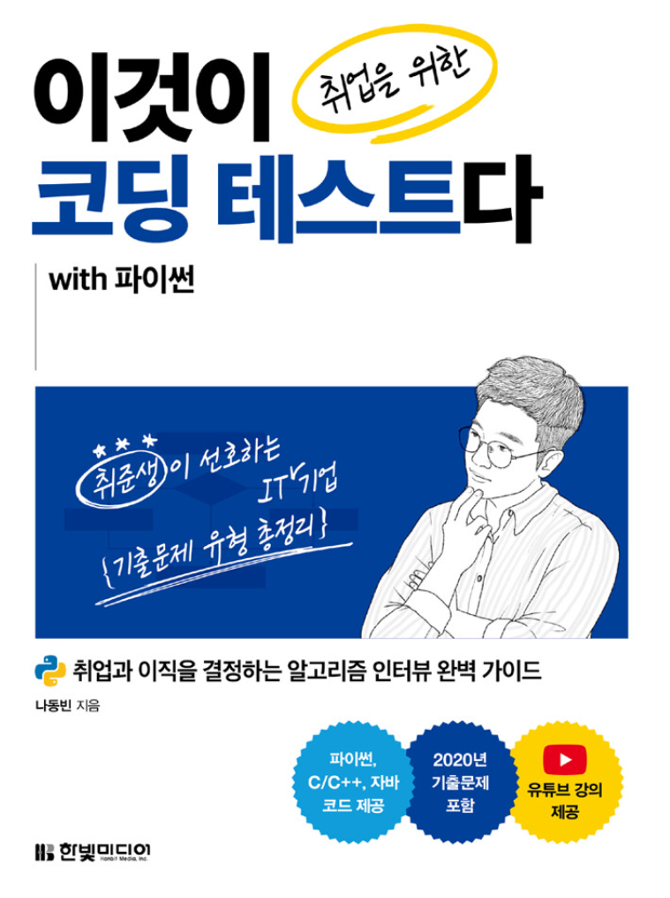

# 이것이 취업을 위한 코딩 테스트다[↩](../../../)
> 강사 : 동빈나 [🖥](https://github.com/ndb796/python-for-coding-test)

* Part2 : 주요 알고리즘 이론과 실전 문제
    * Chapter 3 : 그리디[👉](./3_greedy.md)
    * Chapter 4 : DFS/BFS[👉](./4_DFS_BFS.md)
      * 1/21(금) Q3 :음료수 얼려 먹기[✏](4_DFS_BFS_problem_1.md)
      * 1/21(금) Q4 : 미로 탈출[✏](4_DFS_BFS_problem_2.md)

* Part3 : 알고리즘 유형별 기출문제
    * Chapter 11 : 그리디 문제
      * 12/20(월) Q04 : 만들 수 없는 금액[👉](./11_greedy_problem_4.md)

    * Chapter 12 : 구현 문제
      * 12/20(월) Q07 : 럭키 스트레이트[👉](./12_impl_problem_7.md)

    * Chapter 13 : DFS/BFS 문제
      * 12/22(목) Q15 : 특정 거리의 도시 찾기[👉](./13_DFS_BFS_problem_1.md)
      * 12/22(목) Q16 : 연구소[👉](./13_DFS_BFS_problem_2.md)